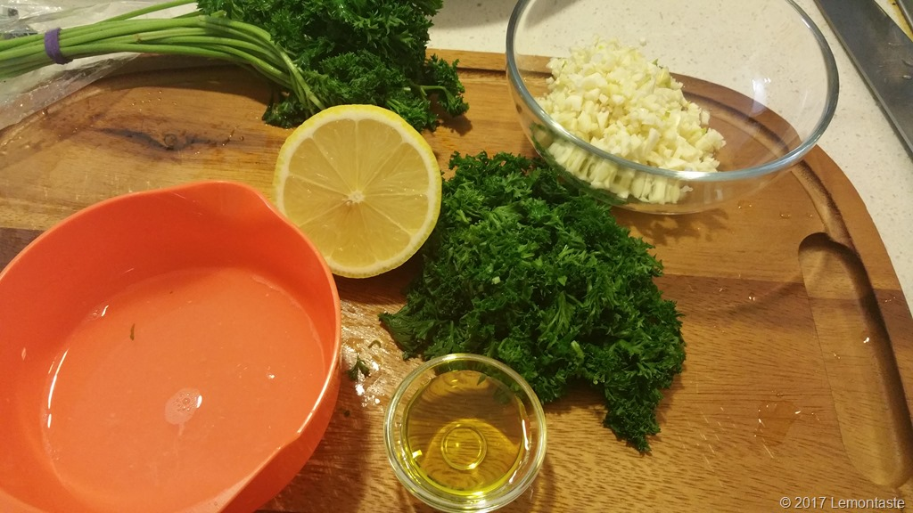
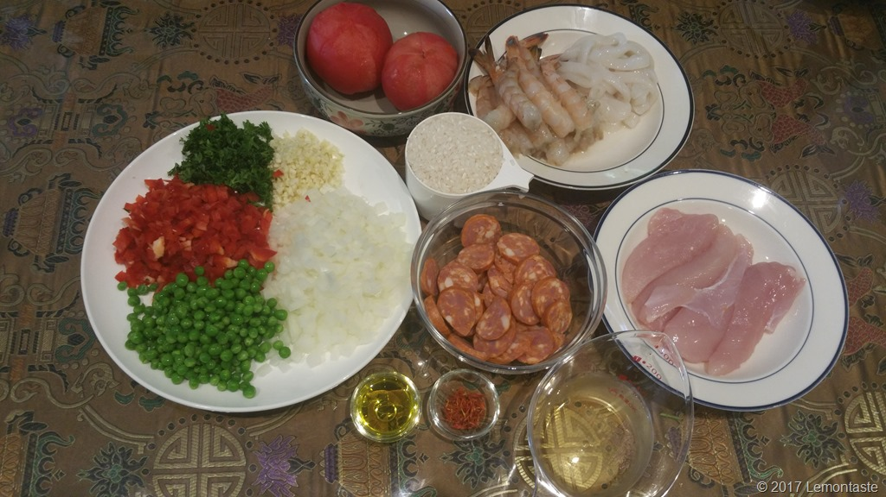
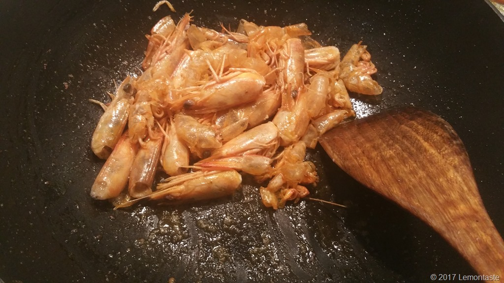
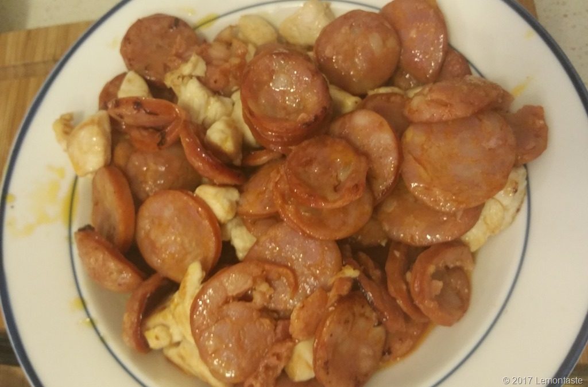
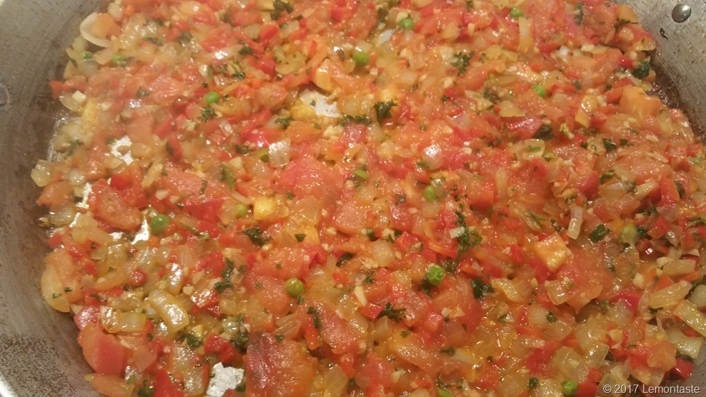
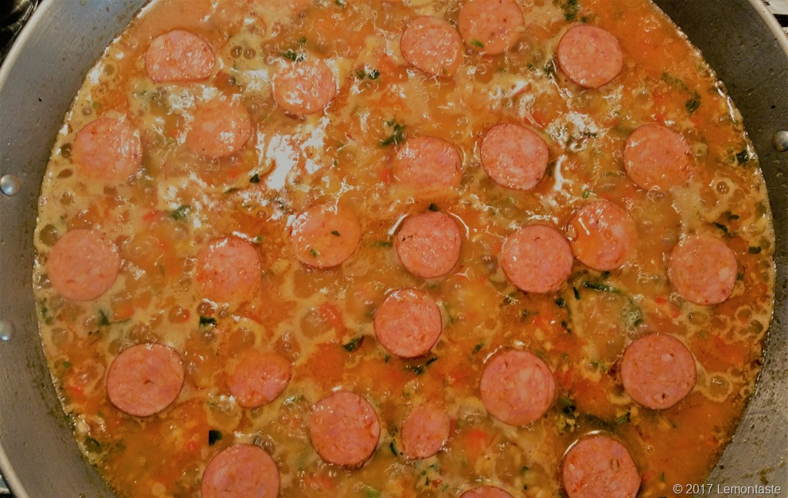
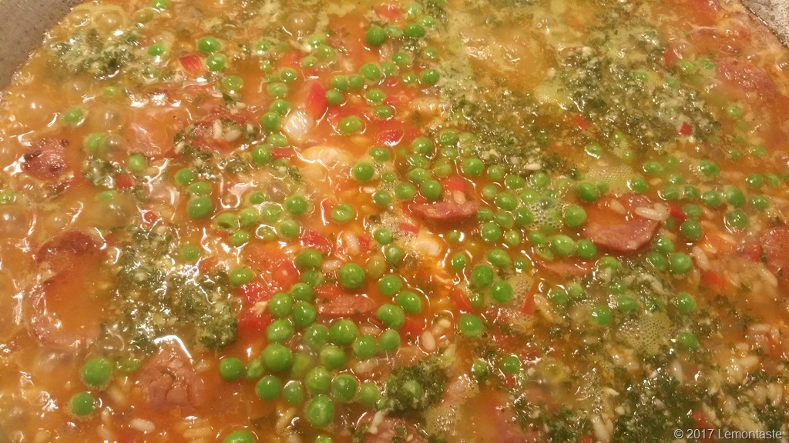
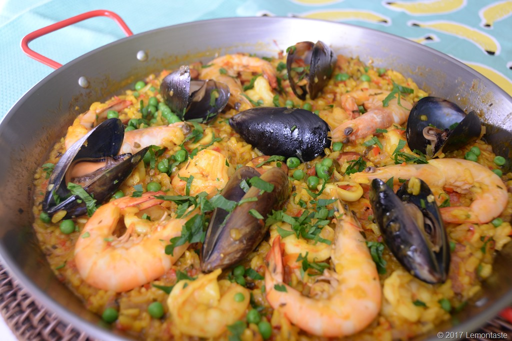

This dish combined all my favorite food: seafood, tomato, chorizo and rice….The preparation process is a bit complicated, but definitely worth the effort!

Prep time: 15 mins

Cooking time: 45 mins

Serves: 4

## Ingredients

###### A &#8211; Stock

Prawn shell and head (Peeled from the prawn prepared for the Paella)

1 Chicken frame

1 tablespoon olive oil

###### B- Sauce

1/2 cup chopped fresh parsley

2 tablespoon fresh lemon juice

1/2 tablespoon olive oil

1/2 garlic cloves, minced

###### C &#8211; Paella

1 tablespoon olive oil

1 shallot onion finely chopped

1/2 garlic cloves, minced

1/2 cup parsley finely chopped

2 medium fresh tomatoes, peeled and finely chopped

1 teaspoon saffron threads

1/2 red capsicum finely chopped

1 teaspoon smoke paprika

1 cup uncooked Arborio rice or other short-grain rice

150 ml white wine

1/2 cup frozen peas

8 mussels, scrubbed and de-bearded

300g prawn, peeled (keep the shell aside for cooking stock &#8211; as above in Section A)

100g squid ring

4 chicken thighs cut into small cubes

1 link Spanish chorizo sausage, cut into thick slices

###### Decoration

Lemon wedges (optional)

1 tablespoon Parsley finely chopped (optional)

<!--more-->

## Instructions

###### **Step 1**

Prepare the stock, it is important to have rich stock that's where the most of the flavour comes from in the paella. I like to use mixture of seafood and chicken stock. you can use any stock you like, even canned chicken stock from supermarket will do if you are in the rush. The stock can be prepared a day ahead to shorten the cooking time in one day.

Heat up 1 tablespoon olive oil in a pot, add in prawn shell tossed it often until the oil turns into yellow/orange colour with nice seafood smell. Add into chicken bones and pour into boiled water, make sure water covers all ingredients. Bring to boil for 10 mins, then turn into medium heat continue to simmer for another 30 mins or until the soup reduced to the half of the volume. Drain the stock into a bowel set aside.

###### **Step 2**

Blend all ingredients in B &#8211; Sauce section into green runny sauce set aside.

###### **Step 3**

Heat 1 teaspoon olive oil in a small fry pan, add chicken cubes cook and stir until start showing brown colour. Add chorizo and cook for another 2 minutes. Remove from the heat and set aside.

###### **Step 4**

Heat olive oil in a 30cm Paella pan or large flat pan over medium high heat. Add chopped shallot and garlic, stir often until onion has soften and smell nice. Add tomato, red capsicum and parsley, cook and stir until the tomato becomes soft and juicy. Add paprika, saffron and rice, stir to coat. Add white wine cook until the alcohol completely evaporated.

###### **Step 5**

Add stock into Paella pan and make sure all rice are levelled and covered in stock. Add in salt and pepper. Press chicken and chorizo on top of the rice. Turn to medium heat and simmer, uncovered, for 20 minutes or until stock has absorbed.

###### **Step 6**

Top rice with peas, prawns, octopus and mussels. Cook, covered, for 10 minutes or until rice is tender and mussels are open.

###### Step 7

Serve with lemon wedges and parsley.

<em><strong>Tips:</strong></em>

  * Don't stir the rice after stock added in. This is to avoid too much starch comes out of the rice which could cause the paella turn out too sticky. Good paella should maintain the tender taste of rice when it's done.
  * Add salt and pepper in the stock before add into the pan to avoid stir the rice.
  * Choose similar size seafood to ensure all seafood cooked evenly.
  * How to peel fresh tomato: slightly crossed the skin at the bottom of the tomato then soak in hot water for 5 minutes. The skin will easily peeled off itself.
