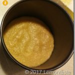
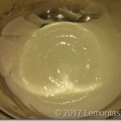
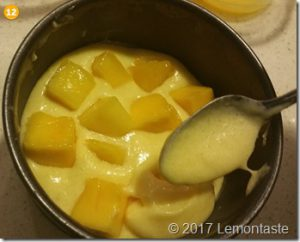
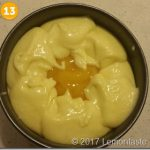
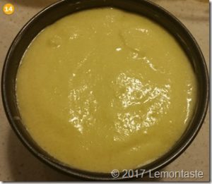
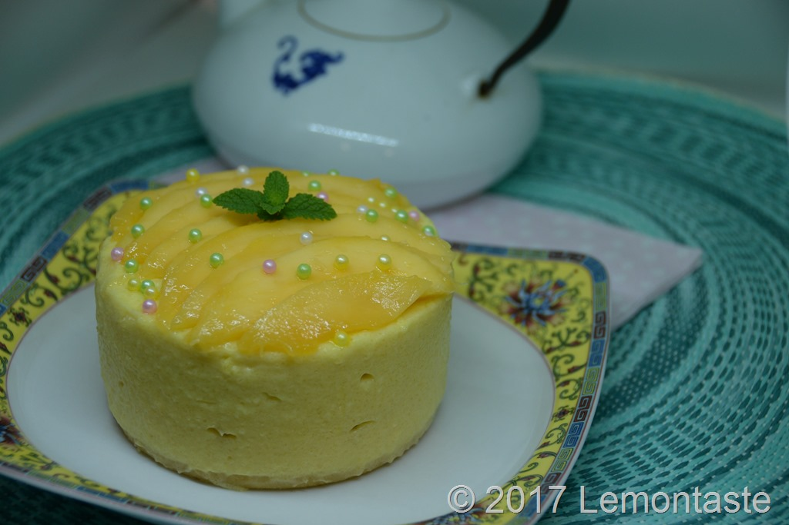
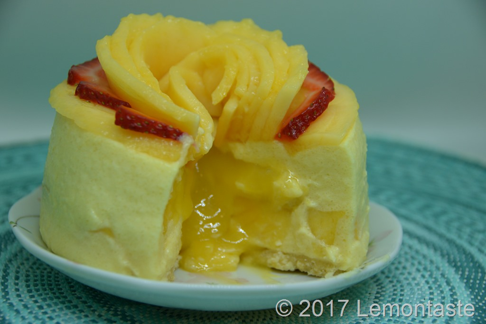

What is the best thing about November? For me it’s the Mango season starts! Anything with Mango tastes good to me, mango smoothie, salads, ice cream, cakes list goes on…as one of my special and must make recipe every year, I’d like to share this one first to celebrate the arrival of Mango season and summer time! The texture of this mango cake is silky tropical with a bit cheese twist. It&#8217;s not one of the firm rich cheese cake but a more refreshing summer dessert.

Prep Time: 30mins

Waiting: 7 hours

Serve: 4~6

Size: 6&#8221; inches (For 8&#8221; inches simply double the ingredients)

<!--more-->Ingredients

###### A- Base

80g finely crushed biscuit

30g melted butter

###### B- Mousse Cake

200g Diced fresh Mango

350g Mango purée(300g + 50g)

150g Thicken Cream

50g Mascarpone Cheese

60g Caster Sugar

15ml Lemon Juice

1 tbsp. Gelatine powder

1/2 Cup warm water

###### Decoration

200g Whipped Cream

200g Mango

##### Instructions

###### Step 1

Process biscuits in a food processor until finely crushed. Or put biscuits in a sandwich bag and use a rolling pin to crush them. Add melted butter pulse to combine. Press over the base of a 6 inches springform pan. Chill for minutes or until firm.

###### Step 2

Meanwhile, prepare the mangos. Dice peeled mango into nice cubes, keep 200g nicely diced mango in a separate bowl. Weight the remaining chopped mango cubes make sure you have minimum 350g left, this is to make the mango purée.

###### Step 3

Process the 350g diced mango, caster sugar, lemon juice in a food processor until you have smooth mango purée. Separate mango purée into two serves: 300g (to make the cake batter) +50g (to make the soft heart).

###### Step 4

Dissolve gelatine powder in warm water then pour into the 300g mango purée mix well.

Use an electric mixer to beat the cream and cheese until smooth and just start getting fluffy, showing ripples but disappear immediately. Then fold 1/3 cream mix into mango purée, mix well. Then fold it back into the remaining cream mix.

###### Step 5

Pour 1/3 the mousse mixture over the biscuit base. Top with half the mango cubes, then cover with another 1/3 mousse mixture. Top with the remaining mango cubes but not in the central , pour the 50g Mango purée carefully in the centre of the cake, then cover with the remaining mousse mixture. Make sure to start pouring the mixture from the outside first and slowly circle into the centre to cover the soft heart of the mousse cake. Shake the pan slightly to make the even surface.

###### Step 6

Keep the cake in the fridge overnight.

###### Step 7

To take the mousse cake out of the mould, cover the side of the tin with a hot towel for half minute, slightly push the bottom of the pan up to take the cake out.

Decorate the cake with fresh sliced mango pieces on top or whipping cream with your own creativity and serve immediately.

###### _Tips:_

  * In total you will need about 2 large mangos to make this 6 inches cake, another half mango for decoration.
  * If you use Gelatine pieces instead of powder, you need about 2.5 pieces to set 6 inches cake.

